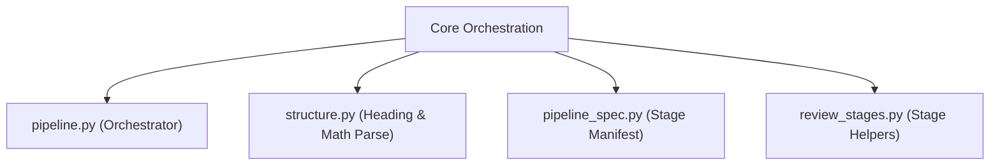
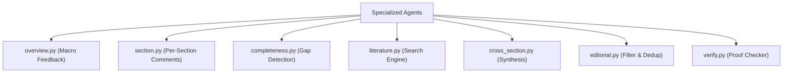
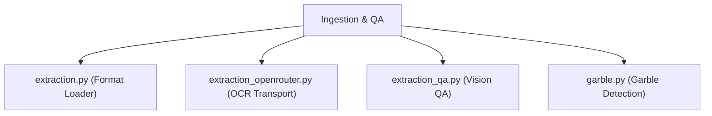
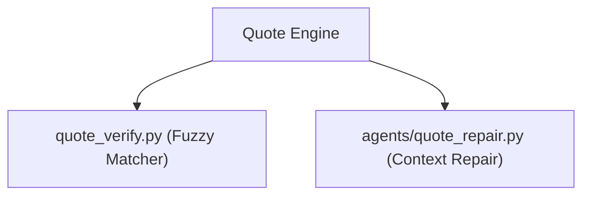
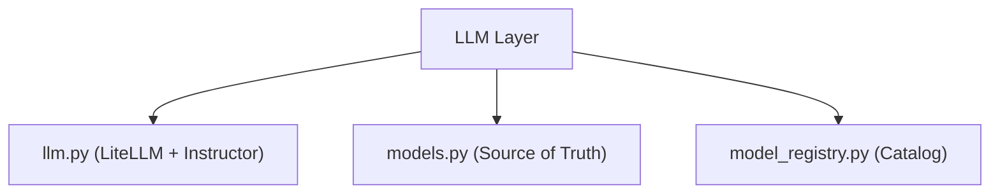
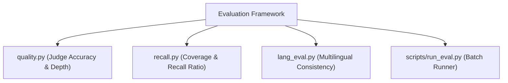
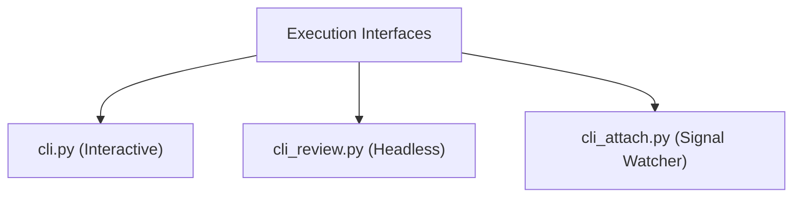
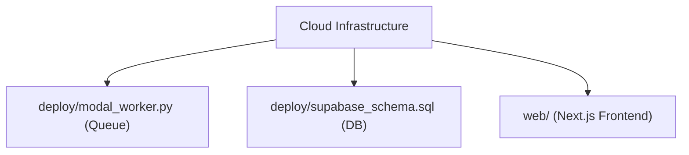
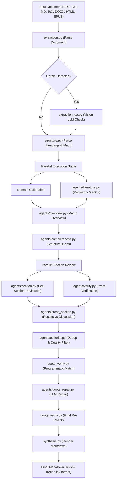

# System Architecture & Component Guide

Welcome to the architectural documentation for `coarse-ink` (import name `coarse`). This document provides a high-level overview of system components, execution pipelines, data transformations, and subsystem interactions.

## Table of Contents

- [System Architecture & Component Guide](#system-architecture--component-guide)
  - [Table of Contents](#table-of-contents)
  - [High-Level Architecture](#high-level-architecture)
  - [Subsystem Architecture](#subsystem-architecture)
    - [1. Core Orchestration Engine](#1-core-orchestration-engine)
    - [2. Multi-Agent Review Subsystem](#2-multi-agent-review-subsystem)
    - [3. Document Ingestion & Extraction](#3-document-ingestion--extraction)
    - [4. Quote Integrity & Verification](#4-quote-integrity--verification)
    - [5. LLM Transport & Model Registry](#5-llm-transport--model-registry)
    - [6. Quality & Recall Evaluation Framework](#6-quality--recall-evaluation-framework)
    - [7. CLI & Headless Handoff Interfaces](#7-cli--headless-handoff-interfaces)
    - [8. Deployment Infrastructure](#8-deployment-infrastructure)
  - [Data Models & Schema Contracts](#data-models--schema-contracts)
  - [Review Pipeline Execution Flow](#review-pipeline-execution-flow)

---

## High-Level Architecture

`coarse` is an automated AI academic paper reviewer designed as an open-source alternative to proprietary services. The framework takes paper documents, parses structural sections, executes domain calibration and literature retrieval in parallel, orchestrates section-specific review agents, verifies verbatim quotes against original text, and renders structured Markdown output.

---

## Subsystem Architecture

### 1. Core Orchestration Engine

The core orchestration layer manages document transformation, pipeline state, stage timing, and cost estimation.

- `src/coarse/pipeline.py`: Main entry point exposing `review_paper()`. Manages stage progression and exception boundaries.
- `src/coarse/structure.py`: Analyzes `PaperText`, extracts table of contents, detects mathematical rigor, and builds `PaperStructure`.
- `src/coarse/pipeline_spec.py`: Defines pipeline stages, dependencies, and token multipliers for runtime planning and cost estimation.
- `src/coarse/review_stages.py`: Isolated stage execution helpers used by `pipeline.py`.

### 2. Multi-Agent Review Subsystem

All LLM agents inherit from `ReviewAgent` in `src/coarse/agents/base.py`. Agents output strongly typed Pydantic objects using Instructor.

- `overview.py`: Generates 4 to 6 macro-level structural critiques of the paper.
- `section.py`: Executes section-by-section detailed comments with verbatim quote extraction.
- `completeness.py`: Identifies missing methodology, missing baseline comparisons, or omitted proofs.
- `literature.py`: Queries literature engines (Perplexity Sonar Pro, arXiv fallback) to verify novel contributions.
- `verify.py`: Performs adversarial mathematical verification on technical sections containing proof assertions.
- `editorial.py`: Filters duplicates, resolves contradictory statements, orders feedback, and enforces quality bars.

### 3. Document Ingestion & Extraction

Supports multiple input file types and OCR paths.

- `src/coarse/extraction.py`: Primary router for document parsing.
- `src/coarse/extraction_openrouter.py`: Transport handler for OpenRouter file-parser plugin requests.
- `src/coarse/extraction_formats.py`: Fallback parsers for non-PDF file formats.
- `src/coarse/extraction_qa.py`: Uses vision LLMs to inspect visual quality when text garbling ratio exceeds threshold.
- `src/coarse/garble.py`: Detects text corruption, character replacement anomalies, and garbled output.

### 4. Quote Integrity & Verification

Guarantees that quotes cited in review comments exist in the source document.

- `src/coarse/quote_verify.py`: Performs multi-tiered fuzzy string matching (exact, normalized, substring, whitespace-agnostic).
- `src/coarse/agents/quote_repair.py`: Batched LLM re-anchoring pass for near-miss quotes prior to final verification.

### 5. LLM Transport & Model Registry

Unified abstraction layer over LiteLLM and Instructor.

- `src/coarse/models.py`: Single source of truth for all LLM model identifier strings across the system.
- `src/coarse/llm.py`: Wraps API client initialization, retry strategies, cost tracking, and structured output parsing.
- `src/coarse/model_registry.py`: Catalog of LiteLLM context windows and pricing overrides.

### 6. Quality & Recall Evaluation Framework

The evaluation infrastructure benchmarks generated reviews against ground-truth expert human reviews.

- `src/coarse/quality.py`: Scores accuracy, depth, quote precision, and clarity using single-judge or multi-judge panels.
- `src/coarse/recall.py`: Maps generated comments to ground-truth human comments to measure discovery rate.
- `src/coarse/lang_eval.py`: Evaluates consistency across supported languages to ensure identical technical rigor.

### 7. CLI & Headless Handoff Interfaces

Provides command-line interfaces for local interactive execution and remote handoff workflows.

- `src/coarse/cli.py`: Typer-based interactive CLI with live Rich progress indicators.
- `src/coarse/cli_review.py`: Standalone CLI executable for headless local runs.
- `src/coarse/cli_attach.py`: Signal watcher for long-running headless background tasks.
- `src/coarse/headless_review.py`: Shared orchestration logic for headless execution.

### 8. Deployment Infrastructure

Serverless backend and web interface setup.

- `deploy/modal_worker.py`: Serverless task queue implementation deployed on Modal.
- `deploy/supabase_schema.sql`: Database schema definition for review states, user tokens, and rate limits.
- `web/`: Next.js web application frontend.

---

## Data Models & Schema Contracts

Core data structures are defined in `src/coarse/types.py`:

- `PaperText`: Raw extracted text, token estimate, and garble ratio.
- `PaperStructure`: Parsed hierarchy, title, domain, sections, and math flag.
- `OverviewFeedback`: Macro issues including titles, bodies, and statuses.
- `DetailedComment`: Section comment containing verbatim quote and remediation feedback.
- `Review`: Complete output structure combining overall feedback and detailed comments.
- `CostEstimate`: Breakdown of expected token costs prior to pipeline execution.

---

## Review Pipeline Execution Flow

This flowchart illustrates the end-to-end data transformation from raw document ingestion through parallel agent review and final Markdown synthesis.

